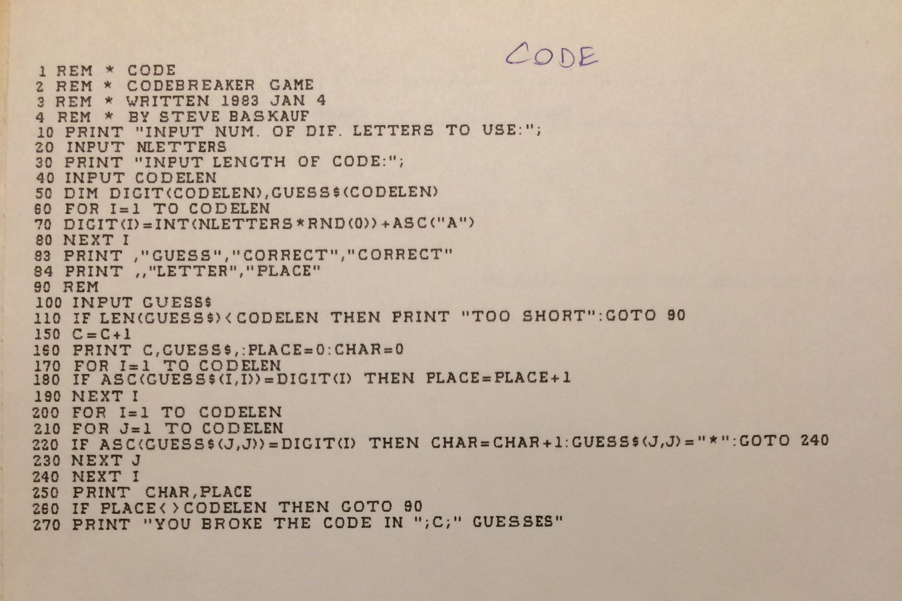

# Historical notes

## Codebreaker (code.bas)

code.bas is a "Mastermind"-like game I wrote in 1983.  I'm guessing that it was for Atari BASIC (on a computer with 4k memory) because that was the computer I had access to at work (Ridgemont High School science classroom, Ridgeway, Ohio).  

You can try running this version of the program using the Applesoft BASIC simulator at https://www.calormen.com/jsbasic/

Here's a printout of the original program listing:



The  Applesoft BASIC code here differs from the original because the original BASIC handled strings differently.  Strings were handled as arrays, so in line 50, the GUESS$ variable was defined like an array.

Referencing characters in the string was done by GUESS$(startchar,endchar), i.e. the 3rd character would be GUESS$(3,3).  This code uses the MID$ function, so the corresponding reference would be MID$(string,startchar,mumchars), i.e. the 3rd character would be MID$(GUESS$,3,1).  So lines 180 and 220 were modified accordingly.

A character within a string could also be replaced by just assigning a new character to a position.  In the original code, double-counting a character was prevented by replacing a matched character with "\*".  The code here replicates that method by the more complicated

```
GUESS$=LEFT$(GUESS$,J-1)+"*"+RIGHT$(GUESS$,CODELEN-J)
```

The original code did not require error trapping for a entered string that was too long, because the string array would ignore extra characters.  The code here doesn't do any error trapping for a string that's too long.

The only other difference in the code is in the random number generating function.  I don't remember what RND(0) did - probably used the clock as the seed.  In the [Applesoft BASIC reference](https://www.calormen.com/jsbasic/reference.html#String-Functions), a positive number argument is supposed to return a random number between 0 and 0.999... and a negative number argument is supposed to reseed the generator.  So I used RND(1) in this code.  However, [the Applesoft emulator I used](https://www.calormen.com/jsbasic/) does not reseed the generator, so the code generated for a given number of characters and positions is always the same.  Bummer.
