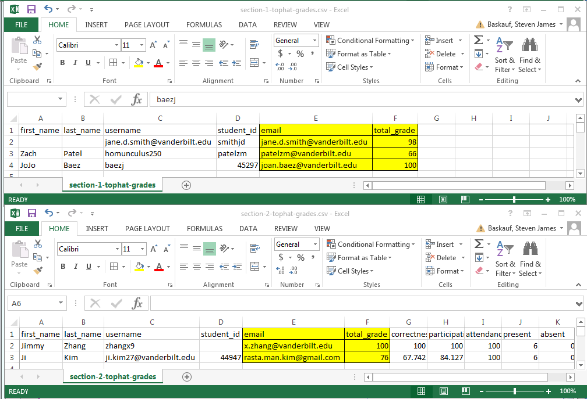
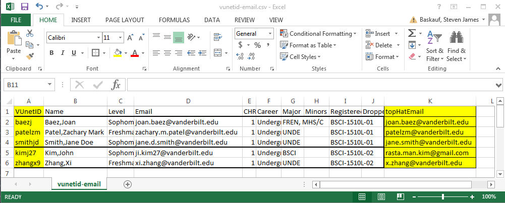
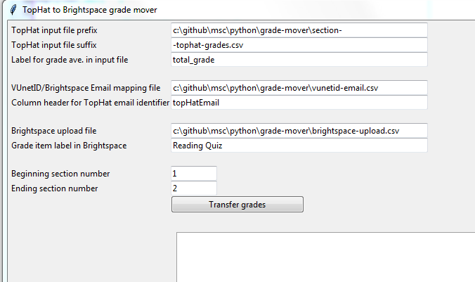
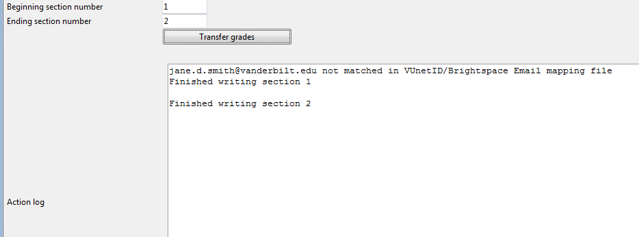
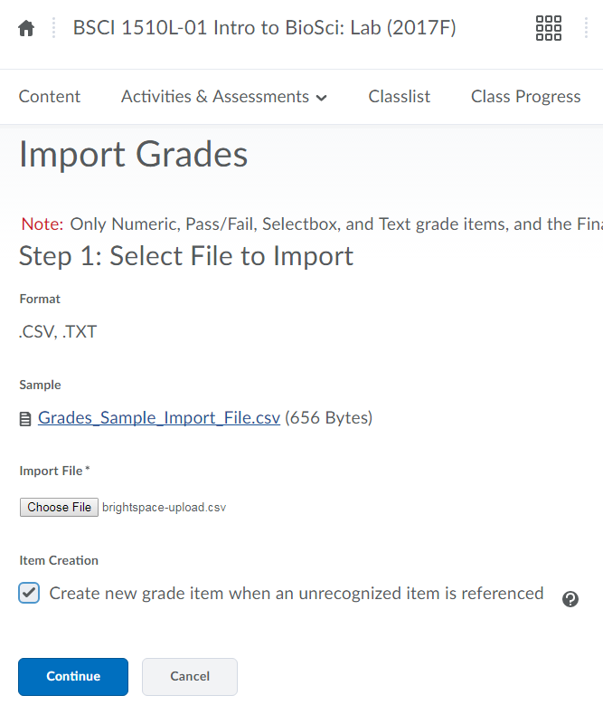
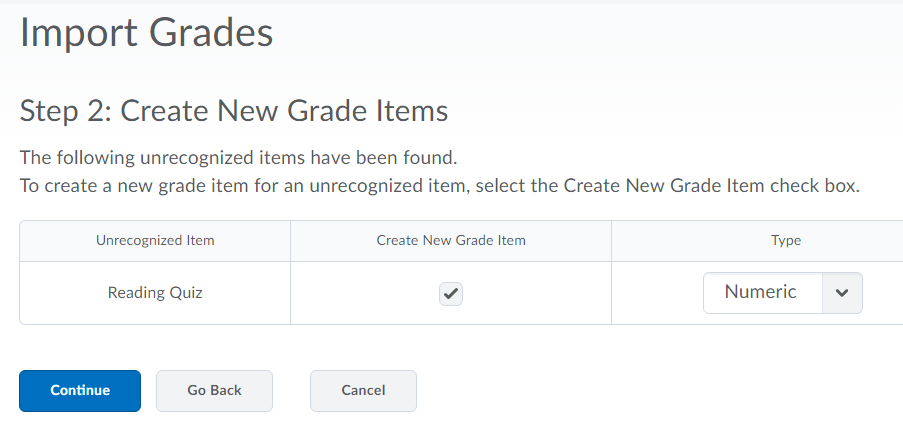
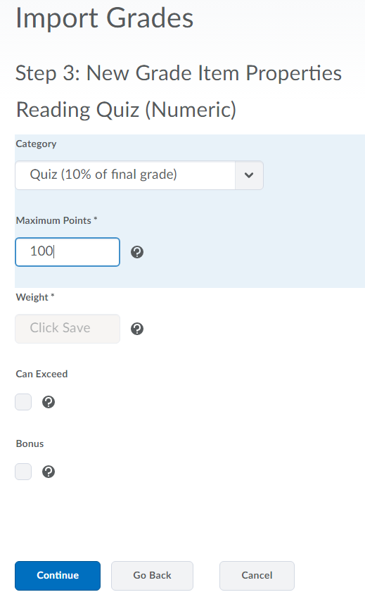

[jump to a detailed explanation](use.md)

# Grade Mover
A Python script to convert TopHat grade exports into a form that can be uploaded to Brightspace

## Getting started
1. To use this software, you need to have Python3 installed on your computer.  You can download it from the [Python downloads page](https://www.python.org/downloads/).

2. The script requires the CSV package.  If you don't already have it, you can install it after you have installed Python3.  Go to the command prompt and enter:
```
pip install CSV
```
(pip is included by default in Python versions later than 3.4.)

3. You need to have the program grade-mover.py on you computer.  You can get it directly from this directory, or you can clone this whole repo and get it and its associated test files that way.

## What Grade Mover does

At Vanderbilt, we have adopted TopHat as a bring-your-own-device (BYOD) personal response system.  There is an integration between TopHat and Brightspace, Vanderbilt's university-wide learning management system. However, this integration does not support multiple sections per course.  Also, TopHat does not enforce the use by students of Vanderbilt's system unique identifier (VUnet ID). Rather, all students are uniquely identified by the email that they used to sign up for the service, which may or may not be a valid Vanderbilt email address.

In order to perform a bulk download of TopHat scores for upload into Brightspace, I've created Grade Mover to merge TopHat scores from one or more sections, match the students with their VUnet IDs, then output the grades data in a form that can be ingested by Brightspace.

# Input file formats

There are two sources of data used by Grade Mover.  

One source is the output file generated by TopHat when you do an Excel export from the gradebook.  Note: one current deficiency of TopHat is that there is no simple way to export individual item scores.  Performing an export by student provides only the total grade average.  One can export the entire grade summary by student page, or do a custom export that only includes some of the data.  For the purposes of Grade Mover, it doesn't matter as long as a total grade average is included.  

The figure below shows output for two sections of a class.  In the first spreadsheet, some columns have been edited out, and in the second all columns were left as they were when the entire page was downloaded.  The column label for the email address is "email" and the label for the total grade average is "total_grade", although this label may be "Average %" or something else if you do a custom export.  All of the other columns are ignored by the program.  The order of columns is also unimportant.  

In order for the TopHat export file to be used by Grade Mover, it must be saved as a CSV formatted file (rather than xlxs). You can do that using the Save as... menu item.  The name you give the CSV file must contain the section number as a single digit somewhere in the name. In this example, I used "section-1-tophat-grades.csv" and "section-2-tophat-grades.csv" for the file names.  Be consistent in your naming, changing only the section number.



The other data source needed is a CSV file that relates the VUnet ID to the email used as an identifier by TopHat. The easiest way to create that file is to go to Online Grading (a part of the YES system) and download the section roster.  If you are processing multiple sections, stack the data for each section in the spreadsheet without repeating the column header line.  Here is an example:



I did not change then names of the column headers from what they are in the downloaded file.  

You must add a column in this table for the email address identifiers from TopHat.  You can call this column whatever you want.  I recommend "topHatEmail" because that's the default in Grade Mover.  To fill in this column, I performed a sort (by last name, then first name) of the TopHat download file, taking care that the rows lined up exactly.  Then I copied the email addresses in the TopHat download file and pasted them in the file I generated from the Online Grading download.  
The order of columns are not important and any columns other than the one containing the VUnet ID and topHatEmail will be ignored.

Save the file as a CSV.  You can call it anything you want.  

## Running Grade Mover

To run the program from the computers graphical interface, navigate to the directory where the program was saved, then double-click on the program icon.  

To run the program from the command line, open a command window, navigate to the directory where the program was saved, and enter:
```
python grade-mover.py
```

When the program is running, you should see an interface like this:



The first section of the input form is to designate information about the files exported from TopHat.  If you put the file ```section-1-tophat-grades.csv``` in the directory ```c:\Dropbox\bsci111\python\```, then the part of the file path in front of the section number goes in the first box, and the part of the file path after the section number goes in the second box.  The column header for the grade in the file goes in the next box.  If you exported the whole student gradebook page from TopHat, the label will be ```total_grade```.  If you didn't, it might be something else.  

The second section of the input form is about the mapping file that relates the TopHat email address identifier to the VUnet ID.  The first box in this section is the path to where you saved the file.  If you created this file from an Online Grading download, the column header for the VUNet ID will automatically be "VUnetID".  If the header label is something else, you'll need to change it in first section of the program code. If you called the column of TopHat email identifiers "topHatEmail", you don't have to do anything; otherwise, change what's in the second box of this section.  

The third section is about the CSV file that the program is going to create for you to upload to Brightspace.  The first box is the file path for the file to be created.  Make sure that the directory exists already (the program isn't bullet-proof).  The file does not have to exist - the program will create it.  If there is already a file in the directory by that name, the program will write over it.  The grade item label is the label that will be assigned to the grade item after you upload the file to Brightspace.  (You'll have an opportunity to assign the grade item to a gradebook category during the upload process.)

The final section of the form is to indicate the range of sections over which the program will pull from TopHat output files.  In the example data, there are two sections, numbered 1 and 2, so if the program should pull data from both of these files, the beginning section number should be "1" and the ending section number should be "2".  If there is only a single section, put the same number in both boxes.

Note: if the defaults in the box aren't what you like, you can open the program grade-mover.py with a text editor and change the values to whatever you want.  Save the .py file and the defaults will be updated the next time you run the program.

When you've made any necessary changes to the values in the boxes of the form, click the "Transfer grades" button.  The Action log at the bottom of the screen will show you when it's finished processing the data from each section.  



Notice that in the example above, the program failed to match one of the section 1 students in the TopHat output file with her VUnet ID in the mapping file.  If you look carefully, you'll see that her email in the TopHat output file was given as jane.d.smith@vanderbilt.edu, but in the mapping file it was given as jane.smith@vanderbilt.edu .  In a case like this, correct the mapping file, then have the program transfer the grades again.  If you have any dummy test students enrolled in TopHat, their emails will also show up as unmatched.

## Uploading the generated file to Brightspace

**Note about Brightspace upload file format:** the sample CSV file provided as a template by Brightspace is somewhat cryptic.  The critical aspect of the file is the header used for the grade column.  In order for the import to be successful, it appears that the header label for the column containing the grade must end with " Points Grade".  The part of the label before that will be used to create the grade item label.  For example, if the upload CSV file has the header "Reading Quiz Points Grade", the grade item label will be "Reading Quiz".  Grade Mover takes care of this by appending " Points Grade" to the desired grade item label that the user enters in the input form.

The end product of running Grade Mover is a single file that contains the grades from all sections.  To upload the file to Brightspace, go to Course Admin, then Grades.  Click on the Enter Grades tab, then click the Import button.  



Click on the Choose File button and navigate to the file that was generated by the Grade Mover program.  Check the box for "Create new grade item when an unrecognized item is referenced", then click Continue.



You will then see the Create New Grade Items screen.  Click the Continue button.



The next dialog screen is where you can assign the new grade item to a category.  In our case, it's the Quiz category.  Since the points that we downloaded from TopHat are percents, set the Maximum Points to 100.  

The final screen lists any errors or warnings.  If everything worked OK, click Continue here and for the following Preview Imports screen.  The grades should then appear in your Brightspace gradebook.
