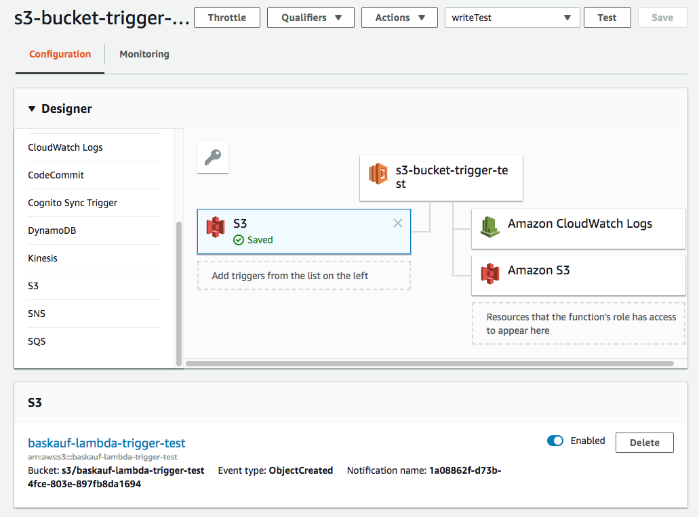

# S3 bucket file drop trigger test

**Note:** in order to save output from the function, I used the Python boto3 module.  That seems to be a know, built-in package, so I was able to invoke it without uploading it along with the script as one must with a generic package.

I used information from https://medium.com/@stephinmon.antony/aws-lambda-with-python-examples-2eb227f5fafe particularly with respect to setting up an IAM role that allows writing to the S3 bucket.

## Create an S3 access role

1. On the Services page, select IAM from the Security, Identity & Compliance section.
2. Click on Roles on the side menu.
3. Click on the Create roles button.
4. Chose Lambda from the service to use the role.
5. Click the Next: Permissions button.
6. Type "AmazonS3" in the Filter box until "AmazonS3FullAccess" appears.  Check its box.
7. Type "AWSO" in the Filter box until "AWSOpsWorksCloudWatchLogs" appears.  Check its box.
8. Click the Create Policy button.  
9. In the Create policy window, cancel (not sure what happened here).
10. Back in the Create Role window, the policies chosen should be there.  In the Role name box, put a name.  I used "lambda_s3_access"
11. Click the "Create role" button.  
12. The role should show up in the role list now.

## Create a Lambda function
1. On the Services page, select Lambda.
2. Click Create function
3. Under Author from scratch, type a function name.
4. Under Runtime, select Python 3.6
5. Under Role, select Choose an existing role.
6. Under Existing role, select the role you just created (lambda_s3_access).
7. Click Create function

## Create the S3 buckets
1. If necessary, create a bucket that will operate the trigger.  Make sure that the bucket is in the same region as the Lambda function that will be triggered by it.  It appears that the name must be unique among the bucket names in that region.  I guess that is because the URI is pretty simple:

```
https://s3.us-east-2.amazonaws.com/baskauf-lambda-trigger-test/payload.json
```

2. If necessary, create a bucket that will receive the results of the function. Again, it must be in the same region.  Note: do not use the same bucket that triggers the function as the one to receive the results!  In that case, writing the results will trigger the function again, causing an infinite loop that I don't know how to stop!

## Lambda function to test output to an S3 bucket
1. If necessary, in the Lambda online console for Lambda, navigate to the function to be edited.  (If you just created the function you may already be there.)
2. In the Designer pane, you should see your script name at the top of the box diagram and the permissions that you enabled on the right of the box diagram. 
3. Here is the script I created

```python
import boto3

def lambda_handler(event, context):
    outString = "Here's some text."
    bucket_name = 'baskauf-lambda-output'
    file_name = 'output-test.txt'
    folder = ''
    s3_path = file_name

    s3 = boto3.resource("s3")
    s3.Bucket(bucket_name).put_object(Key=s3_path, Body=outString)
```

4. I created a test to run it.  The template doesn't matter since we aren't getting an input anyway.
5. Click the Test button.  
6. In the S3 console, navigate to the bucket. If it's already open, refresh the page to see that the file has been created.

## Lambda function to test triggering by adding a file to an S3 bucket
1. One of the issues involved in this case is knowing whether anything happened.  At the function page, there is a Monitoring tab, and under that tab, click on the View logs in CloudWatch.
2. The Cloudwatch log lists events for a particular Lambda function.  So whenever it is invoked, there should be a new, timestamped entry.  Click on the entry to see if it worked or if there was an error message.  Sometimes there is a short delay, so if the full results aren't there, try again in a minute.
3. In the Designer pane, click on the S3 trigger from the list shown. The trigger will appear in the central diagram in the spot labeled "Add triggers from the list on the left".
4. In the Configure triggers pane, select from the list the S3 bucket that you are going to use to trigger the function.  
5. For this test, I left the Event type at the default "Object Created (All)".
6. I left the rest of the dropdowns at their defaults (empty).  Then click the Add button.
7. This will return you to the online console, with a reminder that you have unsaved changes.  Click the Save button at the top of the screen.  If you click on the S3 box on the diagram, the completed trigger will show up at the bottom with an Enabled on/off button.
8. Here's the script:

```python
def lambda_handler(event, context):
    outString = event['Records'][0]['s3']['object']['key']
    print(outString)
    return outString
```

Here's how the log output looks:


test/key was the output string when I used the built-in Amazon S3 Put event JSON that's available in the Configure test event template list, which looks like this:

``` json
{
  "Records": [
    {
      "eventVersion": "2.0",
      "eventSource": "aws:s3",
      "awsRegion": "us-east-2",
      "eventTime": "1970-01-01T00:00:00.000Z",
      "eventName": "ObjectCreated:Put",
      "userIdentity": {
        "principalId": "EXAMPLE"
      },
      "requestParameters": {
        "sourceIPAddress": "127.0.0.1"
      },
      "responseElements": {
        "x-amz-request-id": "EXAMPLE123456789",
        "x-amz-id-2": "EXAMPLE123/5678abcdefghijklambdaisawesome/mnopqrstuvwxyzABCDEFGH"
      },
      "s3": {
        "s3SchemaVersion": "1.0",
        "configurationId": "testConfigRule",
        "bucket": {
          "name": "example-bucket",
          "ownerIdentity": {
            "principalId": "EXAMPLE"
          },
          "arn": "arn:aws:s3:::example-bucket"
        },
        "object": {
          "key": "test/key",
          "size": 1024,
          "eTag": "0123456789abcdef0123456789abcdef",
          "sequencer": "0A1B2C3D4E5F678901"
        }
      }
    }
  ]
}
```

README.md was the output string when I ran a real test by dropping a file caled README.md into the input bucket.

## Trying to do both a trigger and output

1. On my first go at it, when I tried to apply both the lambda_s3_access role to the function for output (i.e. to allow the Lambda function to write) and the S3 trigger on the input side, I got an error message saying that the two policies coudn't be applied to the same bucket.  However, when I tried again, it worked.
2. The function was created with the lambda_s3_access role.  
3. The S3 trigger was added specifying the correct trigger bucket.
4. The following code was used for the function:

``` python
import boto3

def lambda_handler(event, context):
    outString = "Here's some text."
    bucket_name = 'baskauf-lambda-output'
    file_name = 'output-test.txt'
    folder = ''
    s3_path = folder + file_name

    s3 = boto3.resource("s3")
    s3.Bucket(bucket_name).put_object(Key=s3_path, Body=outString)
```

Note that the uploaded file isn't actually used in any way except to trigger the running of the script, which always ouputs the same text to the same file.

Here's the trigger input setup screen:


Here's the output role screen:


Here's the function code screen:


5. This modification of the script outputs the name of the triggering file instead of the fixed string.

```python
import boto3

def lambda_handler(event, context):
    outString = event['Records'][0]['s3']['object']['key']
    bucket_name = 'baskauf-lambda-output'
    file_name = 'output-test.txt'
    folder = ''
    s3_path = folder + file_name

    s3 = boto3.resource("s3")
    s3.Bucket(bucket_name).put_object(Key=s3_path, Body=outString)
```

6. This more complicated script gets the name of the dropped file, opens it and reads in its text, makes a small addition, then writes the edited text to a file in another bucket.

```python
import boto3

def lambda_handler(event, context):
    # read the file name from the event JSON
    in_file_name = event['Records'][0]['s3']['object']['key']
    in_bucket_name = 'baskauf-lambda-trigger-test'
    in_folder = ''
    s3_in_path = in_folder + in_file_name
    
    # configure the file input and read the file content
    # hacked from https://github.com/aws-samples/aws-python-sample/blob/master/s3_sample.py
    s3in = boto3.resource('s3') # s3 object
    in_bucket = s3in.Bucket(in_bucket_name) # bucket object
    in_file = in_bucket.Object(s3_in_path) # file object
    fileText = in_file.get()['Body'].read() # this inputs all the text in the file
    # infile.get() retrieves a dict.  The value of 'Body' in the dict is the StreamingBody() function
    # So the .read() method reads the stream and it gets passed to fileText
    # see https://boto3.amazonaws.com/v1/documentation/api/latest/reference/services/s3.html#object
    
    # process the input text
    # note: since the fileText was read in as bytes, the .decode() function was required to make it a string
    # not sure what will happen if the encoding isn't utf-8 ...
    outString = 'This was read from the file: '+in_file_name+'\n'+fileText.decode('utf-8')
    
    # configure the output
    out_bucket_name = 'baskauf-lambda-output'
    out_file_name = 'output-test.txt'
    out_folder = ''
    s3_out_path = out_folder + out_file_name

    s3out = boto3.resource("s3")
    s3out.Bucket(out_bucket_name).put_object(Key=s3_out_path, Body=outString)
```
