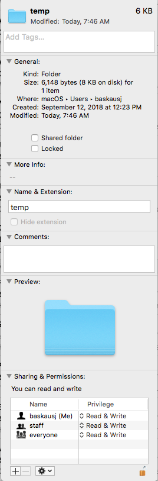

# lambda test using Python

The actual Python script in this test just makes an HTTP GET call to an arbitrary URL, then returns the body from the function.  The tricky thing here is that making the HTTP call requires the "requests" library.  That library and all of its dependencies have to be uploaded in a zip file with the actual Python script.  In Windows, there was no problem using PIP to install the libraries to the directory containing the script.  On Mac, there was a permissions problem with writing to the directory. I tried changing the permissions for a folder (temp) using the Get Info dialog for that folder (a subfolder of my home folder):



I was then able to use pip to download to that folder:
```
pip install requests -t ~/temp
```

The directions for creating a deployment package for Python is at https://docs.aws.amazon.com/lambda/latest/dg/lambda-python-how-to-create-deployment-package.html .  

Once the zip file was uploaded (it replaced the default script), I was able to run it as a test and it worked fine.
