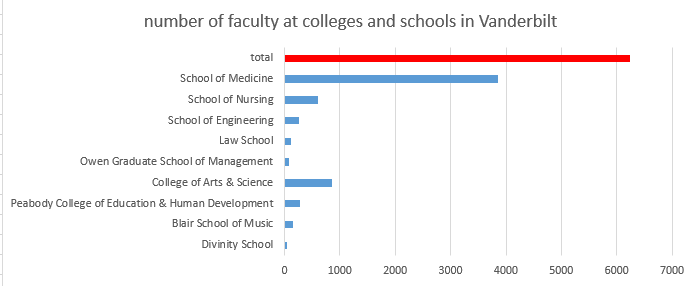

# Faculty breakdown and representation on University Committees

Steve Baskauf - 2017-03-27

## Data sources
Data on faculty were acquired from public information in The Registry of Vanderbilt University (http://virg.vanderbilt.edu/webtools/registry/), the record of current faculty members, their appointments, and qualifications.  The data were acquired on 2017-02-17.

The data on all faculty at Vanderbilt are summarized in [this spreadsheet](vu-faculty.xlsx).  The data on faculty in the schools affected by the proposed unionization are summarized in [this spreadsheet](vu-faculty-affected-schools.xlsx).  

Information on University Committees was acquired from the [Faculty Manual](https://www.vanderbilt.edu/faculty-manual/), specifically [Part I, Chapter 4](https://www.vanderbilt.edu/faculty-manual/part1-the-university-and-its-governance/ch4-university-committees/).  The membership of University Committees was acquired from lists linked at the Provost's website https://www.vanderbilt.edu/provost/committees/index.php, with additional Googling as necessary.

These data were used to construct the figures that follow.  Please note that most numbers should be considered approximate, with inaccuracies caused by people being on leave, miscategorized, retired, etc. or simply due to errors on my part.

## Faculty breakdown

For general perspective, the faculty of the affected colleges and schools (A&S, Peabody, Blair, and Divinity) total 1335 out of the 6239 faculty in the university (21%).  Within the affected schools, the College of Arts and Sciences comprises 64% of the faculty, followed by Peabody (21%), Blair (11%), and Divinity (4%).

Within the four affected schools, the faculty break down by rank according to the above graphic, which excludes emeritus faculty, advisors, and deans.  Subsequent analyses exclude adjoint faculty, whose primary appointments are outside Vanderbilt and who are therefore excluded from unionization.  "Research" series professors are included in the non-tenure track numbers because they potentially teach.  However, since most do not teach, including them inflates the number of potentially affected non-tenure track faculty somewhat.  There are 45 "research" faculty in A&S and 10 in Peabody.  I didn't have any way to find out how many of them taught, so I included them in the numbers since they were included in the list of potential members of the "community of interest"

# Number of tenure track vs. non-tenure track faculty by school and representation on University Committees

\* See end notes

Overall, the number of non-tenure track faculty in the affected schools is slightly less than tenure-track faculty (527 vs. 581).  However, the ratio varies widely with school.  In A&S and Divinity, there are substantially more tenure track faculty than NTTF.  However, in Peabody and Blair, NTT faculty predominate over tenure-track faculty.  

The primary argument made by the University administration for excluding full-time faculty from the unionization "community of interest" was because they participate in University governance through participation in Faculty Senate and University Committees.  Through neglect or design, non-tenure track faculty in A&S are banned from election to Faculty Senate and have been improperly disenfranchised from voting for Faculty Senate for at least ten years.  (I've been here seventeen years and have never had the opportunity to vote.)  See Article IV, Section 2 of the [CAS Constitution](https://as.vanderbilt.edu/overview/cas_constitution2016.pdf) for details.  Non-tenure track faculty are not eligible for election to the A&S Faculty Council, nor are they allowed to vote for Faculty Council representatives (Article II, Section 1, Part B).  

Thus, roughly half of the members of the proposed community of interest (A&S NTT Faculty) have had no voice in University governance through elected representation.  For these members the administration's argument that they participate in University governance hinges on their potential to participate in University Committees.  "Invitations to membership on these standing University Committees are extended in writing by the Chancellor" (Faculty Manual, chapter 4).  The graphic above shows a comparison of the representation of tenure-track and NTT faculty on university committees by school.  Because of the small numbers of faculty on the committees, adding or removing a single individual would have a notable effect on the relative size of the bars.  The CAS NTT bar also includes the 45 research faculty, many of whom do not teach.  Nevertheless, it is clear that the representation of non-tenure track faculty on University Committees is far less than would be justified if it were based on their proportions in the schools.  

The case that NTT faculty in A&S participate in university governance is particularly weak, since their entire participation in Faculty Senate, Faculty Council, and University Committees consists of the membership of three people on committees:
- Issam Eido (Senior Lecturer) on the Religious Affairs Committee
- Shawn Phillips (Senior Lecturer) on the Athletics Committee
- Adam List (Principal Senior Lecturer) on the Chemical Safety Committee

That's it.

# Faculty Senate representation by non-tenure track faculty in Peabody, Blair, and Divinity

In the questions posed to the Provost's office, that office was asked for details on how many faculty in the proposed "community of interest" actually serve as representatives on Faculty Senate.  No answer was provided for this question, and the question was not posted among the FAQ on the Provost's web site.  It would be good to know the answer to this question, but I don't have time to find it myself.

# Non-tenure track faculty participation in the Shared Governance Committee

The Provost has said that she was unaware that A&S NTTF were excluded from elected representation prior to her testimony in front of the NLRB.  (See FAQ "[What opportunities do NTT faculty have to participate in shared governance of the five schools/colleges names in the petition?](https://www.vanderbilt.edu/provost/faculty-unionization/faq.php)") Due to the restrictions imposed by the NLRB rules, that exclusion can't be changed now, but the appointed Shared Governance Committee may be able to suggest changes and improvements in the future.  

I was interested to know what kind of voice non-tenure track faculty have on that committee.  I checked its web page at https://www.vanderbilt.edu/provost/committees/sharedgovernance.php to see who was on it.  I'm not sure about the tenure status of faculty in the biomedical and nursing departments who aren't included in the proposed "community of interest".  But it appears that all committee members are tenure track except for Erin Perez, a Lecturer in Blair.  So one NTTF representative from the proposed community of interest out of eleven members.  Again, no representation for A&S non-tenure track faculty.  

# End note

\* The tenure-track number for CAS includes Prasad Polavarapu twice because he's on two University Committees. The population numbers do not generally exclude people in administrative positions because it was too hard to screen them out.  Because of the small numbers on the University Committees, I did screen out administrators and those whose primary responsibility was not teaching.  For example, Joe Bandy is a Senior Lecturer in Sociology who serves on the Environmental Advisory Committee, but his primary duty is as an Assistant Director of the Center for Teaching.
